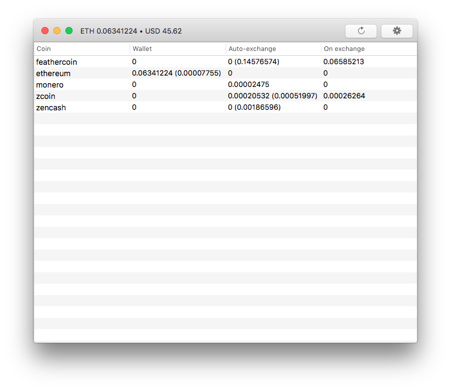

  
  <h1 align="center">MiningPoolHub Monitor for macOS</h1>

## Introduction

_MiningPoolHub Monitor_ is a small monitoring software for _macOS_ intended to monitor your balances on the cryptocurrency mining pool [MiningPoolHub](https://miningpoolhub.com).

  

**Note:** checking your balances requires your _MiningPoolHub API key_. This key is stored in your Mac _keychain_ to avoid any data leak. Using _MiningPoolHub Monitor_ will require a _keychain_ access: it can't work without it!

Don't hesitate to audit the code if you want to know precisely what the software is doing with your key.

## Features

* Displays all your wallets balances using the _MiningPoolHub_ API.
* Displays your main coin (the coin you are auto exchanging into) balance in the toolbar.
* Displays a balance approximation in your preferred fiat currency for your main coin.

## Official releases

Please note that their is **NO OFFICIAL BINARY RELEASE** of this software for the moment.

You can make your own build using [Apple Xcode](https://itunes.apple.com/fr/app/xcode/id497799835?l=en&mt=12) _(available for free on the Mac App Store)_ and the source code provided here.

## License

This sample is distributed under the _MIT License_:

    The MIT License (MIT)

    Copyright (c) 2018 LgdLab

    Permission is hereby granted, free of charge, to any person obtaining a copy
    of this software and associated documentation files (the "Software"), to deal
    in the Software without restriction, including without limitation the rights
    to use, copy, modify, merge, publish, distribute, sublicense, and/or sell
    copies of the Software, and to permit persons to whom the Software is
    furnished to do so, subject to the following conditions:

    The above copyright notice and this permission notice shall be included in all
    copies or substantial portions of the Software.

    THE SOFTWARE IS PROVIDED "AS IS", WITHOUT WARRANTY OF ANY KIND, EXPRESS OR
    IMPLIED, INCLUDING BUT NOT LIMITED TO THE WARRANTIES OF MERCHANTABILITY,
    FITNESS FOR A PARTICULAR PURPOSE AND NON INFRINGEMENT. IN NO EVENT SHALL THE
    AUTHORS OR COPYRIGHT HOLDERS BE LIABLE FOR ANY CLAIM, DAMAGES OR OTHER
    LIABILITY, WHETHER IN AN ACTION OF CONTRACT, TORT OR OTHERWISE, ARISING FROM,
    OUT OF OR IN CONNECTION WITH THE SOFTWARE OR THE USE OR OTHER DEALINGS IN THE
    SOFTWARE.

This repository contains two files from Apple's _GenericKeychain_ sample, these files are covered by the license that can be found in _MiningPoolHub Monitor/Utils/KeychainPasswordItem/LICENSE.txt_.
